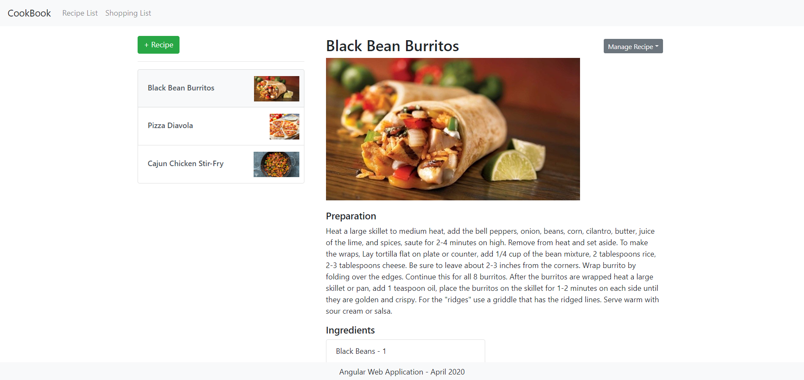
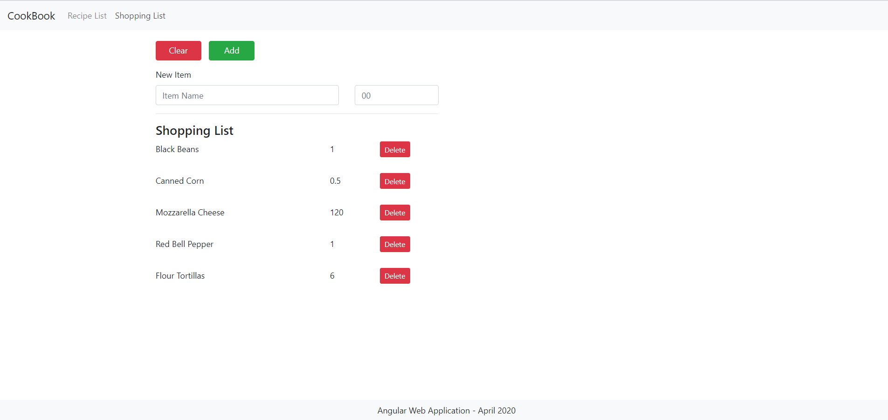
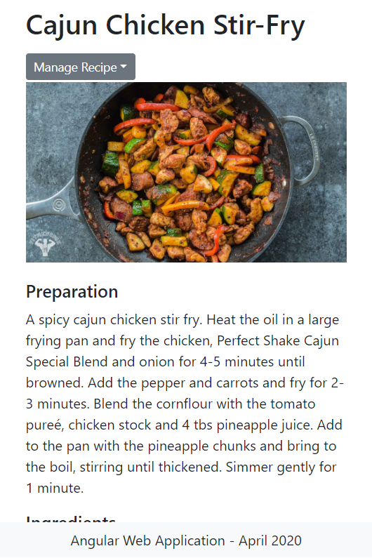
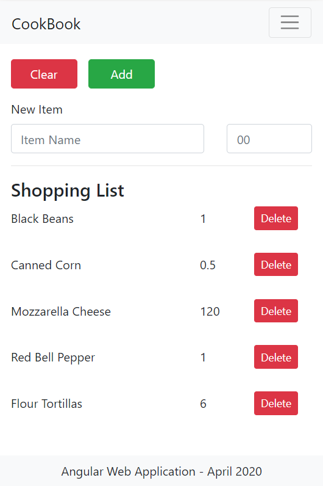

# CookBook

The purpose of this project is to demonstrate the developement of a web application using the Angular framework. The application also contains a mock database to temporarily store data entered by the user. The database has been created using a shared service.

This project involves the following elements:
    - Angular Framework
    - Responsive design using Bootstrap
    - Navigation using the Angular Router
    - Use of shared services throughout the application
    - TypeScript
    - HTML
    - CSS 

## Running the application

Clone the repository to a directory on your computer. In a terminal window, navigate to the cloned directory and run `npm install` to install the required dependencies. Run `ng serve --open` to launch a development server and open the application in the browser. Navigate to `http://localhost:4200/` if the app does not automatically open.

## Screenshots
Home Page

Shopping List Page

Home Page on Mobile

Shopping List Page on Mobile

